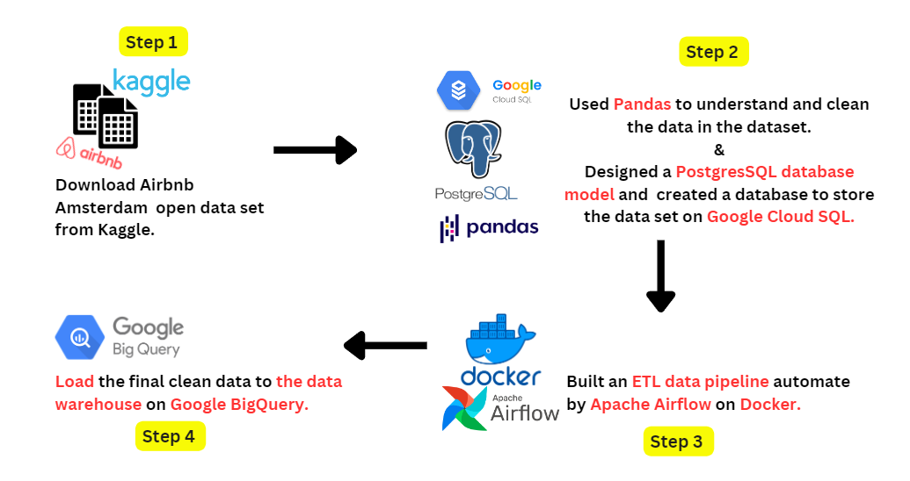
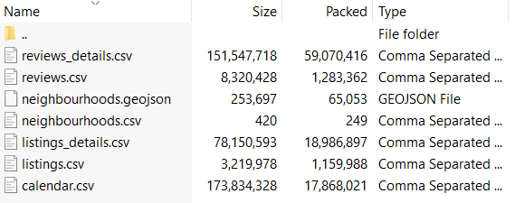
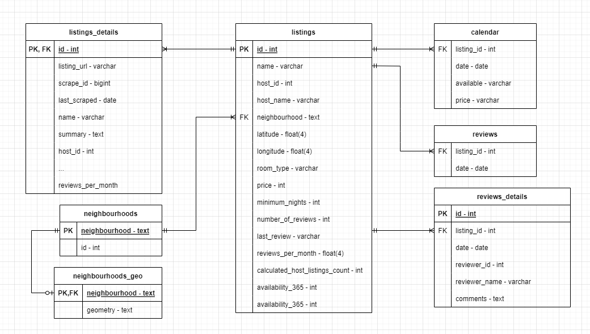
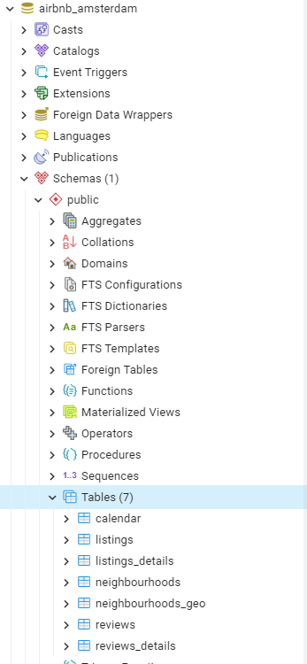
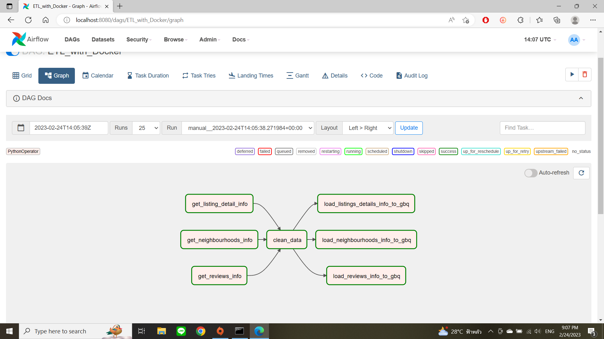
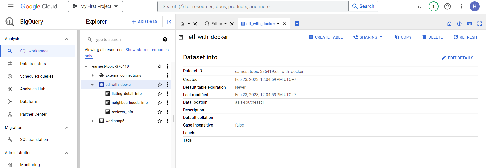

# Database Modeling and Creation & ETL Data Pipeline using Apache Airflow with Docker

### Project overview:

For this personal project, 
- I downloaded a [dataset from Kaggle](https://www.kaggle.com/datasets/erikbruin/airbnb-amsterdam) and **designed a PostgresSQL database model** via `Google Cloud SQL` to store that dataset. I also designed a database ER diagram by myself to ensure a well-structured and organized database.
  - I used **Pandas to understand and clean the data in the dataset**, ensuring data accuracy and consistency. This step helped me to get a better understanding of   the data and its characteristics.

- **To automate the data extraction, transformation, and loading stages, I built an ETL pipeline** using `Apache Airflow on Docker`. Setting up the Apache Airflow environment on Docker was challenging, but it allowed me to run the pipeline efficiently on my local machine.

- For **the extraction stage**, I queried the data from PostgreSQL created in the first step. Then, I used **Pandas for the transformation and cleaning stage**, where I  transformed and cleaned the data to make it ready for loading.

- Finally, **I loaded the final clean data to the data warehouse** on `Google BigQuery` using the ETL pipeline created in the previous step. This allowed me to store the data in a well-organized manner and provided me with an efficient way to query the data for further analysis.

Overall, this project showcases my skills in data engineering, data modeling, and data warehousing. It also highlights my ability to work with different technologies such as Google Cloud SQL, Pandas, Docker, Apache Airflow, and Google BigQuery.

## STEP 1: Understanding the dataset being used.
I downloaded the [Airbnb Amsterdam dataset](https://www.kaggle.com/datasets/erikbruin/airbnb-amsterdam) from Kaggle.

The dataset contains 7 files (6 .csv files and 1 .geojson file). Each of the files contains Airbnb Amsterdam data for different categories, with some column of them being related to others.
The descriptions for each files.
- `calendar.csv` contains 7310950 rows and 4 columns
- `listings.csv` contains 20030 rows and 16 columns
- `listings_details.csv` contains 20030 rows and 96 columns
- `neighbourhoods.csv` contains 22 rows and 2 columns
- `reviews.csv` contains 431830 rows and 2 columns
- `reviews_details.csv` contains 431830 rows and 6 columns
- `neighbourhoods.geojson` contains 22 rows and 3 columns

## STEP 2: Database modeling and Creation
After understanding the dataset files from previous step with Pandas, I designed the database ER-diagram to be like this.

I created a PostgreSQL database via Google Cloud SQL based on the ER-diagram that I designed by cleaning the data with Pandas and using PostgreSQL syntax to create and insert tables for each file in the dataset also assigned the **primary key** and **foreign key** for each table.

## STEP 3: ETL Data pipeline  automated by Airflow on Docker
Using Docker compose to run Apache/Airflow on my local machine to automate the data extraction, transformation, and loading stages.
- **Extraction**: extract the data from PostgreSQL created on the provious step
- **Tranformation**: transform, merge and clean the data with Pandas
- **Load**: Load the data to the datawarehouse on Google BigQuery
#### DAG graph view

## STEP 4: Datawarehousing

The final cleaned data will be stored on the datawarehouse on Google BigQuery.

